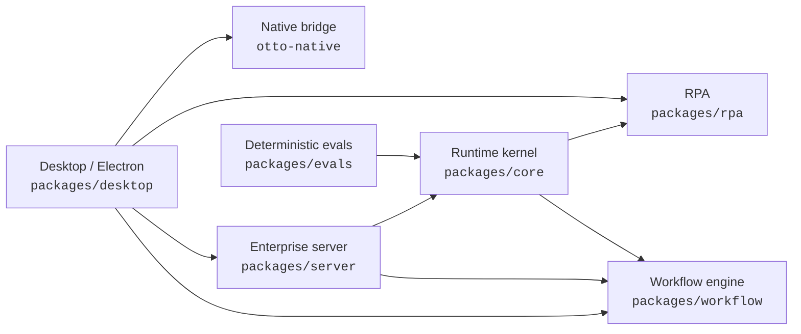
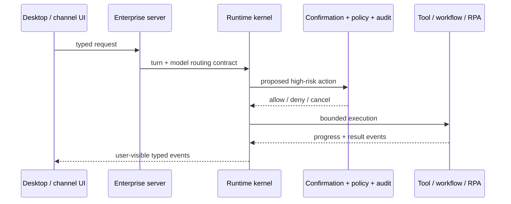
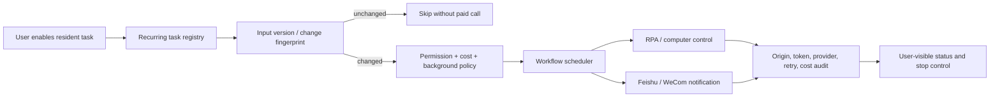

# Otto code map

> Generated by `npm run code-map`. Do not hand-edit generated workspace edges.
> Start here, then use [runtime-kernel-boundary.md](runtime-kernel-boundary.md) for ownership decisions.

## Workspace topology

Arrows mean “imports or depends on”. The kernel does not depend on Desktop or Server product surfaces.

## Interactive request path

## Resident work, scheduling, and RPA

Primary registration points:

- Desktop lifecycle and local recurring work: `packages/desktop/src/main/index.ts`
- Server-side recurring registry: `packages/server/src/server.ts`
- Generic scheduling state: `packages/workflow`
- Computer automation primitives: `packages/rpa`

## Customer module path

```mermaid
flowchart LR
  Wizard[Desktop module wizard] --> Quarantine[Server quarantine]
  Quarantine --> Scan[Manifest, hash, WASM and permission scans]
  Scan --> Review[Human review]
  Review --> Sign[Platform signature]
  Sign --> Registry[Installed module registry]
  Registry --> Host[Versioned customer-module Host ABI]
  Host --> Policy[Confirmation, policy, audit, cost, idempotency]
  Policy --> Events[Declarative UI and typed result events]
```

Customer modules stay outside the runtime kernel. Desktop owns declarative presentation and activation; Server owns review and distribution; the Host ABI exposes only controlled capabilities.

## Versionless macOS Preview path

```mermaid
flowchart LR
  Internal[internal branch] --> Workflow[macos-preview.yml]
  Workflow --> Audit[Doctor, code-map, boundaries, tests, typecheck]
  Audit --> Build[Build Desktop before electron-builder]
  Build --> Matrix[arm64 and x64 packages]
  Matrix --> Prune[Prune alternate telemetry builds]
  Prune --> Gate[120 MiB per-DMG gate]
  Gate --> Verify[hdiutil + SHA-256 + source provenance]
  Verify --> Artifact[Versionless Preview artifact; no release or tag]
```

## Fast lookup

| Need | Start here | Boundary / evidence |
| --- | --- | --- |
| Turn lifecycle, tool state, confirmation, audit contracts | `packages/core` | `docs/runtime-kernel-boundary.md` |
| Enterprise APIs, tenancy, channels, review service | `packages/server` | Server focused tests |
| GUI, tray, local lifecycle, module activation | `packages/desktop` | Desktop renderer/main tests |
| Long-running task state and schedules | `packages/workflow` | workflow tests and recurring registry call sites |
| Computer control and inspection | `packages/rpa` | RPA policy and adapter tests |
| Customer module packaging and execution | Desktop + Server | manifest, registry, Host ABI and market tests |
| Preview packaging and the 120 MiB budget | `.github/workflows/macos-preview.yml` | packaging contract tests + artifact provenance |

## Update triggers

Regenerate this map when any of these change:

- workspace packages or internal dependencies;
- runtime-kernel ownership or public interfaces;
- recurring/background execution, cost, retry, or stop behavior;
- Feishu, WeCom, CLI, RPA, or other channel boundaries;
- customer-module lifecycle, permissions, registry, or Host ABI;
- build matrix, package pruning, signing, size gate, or release provenance.
