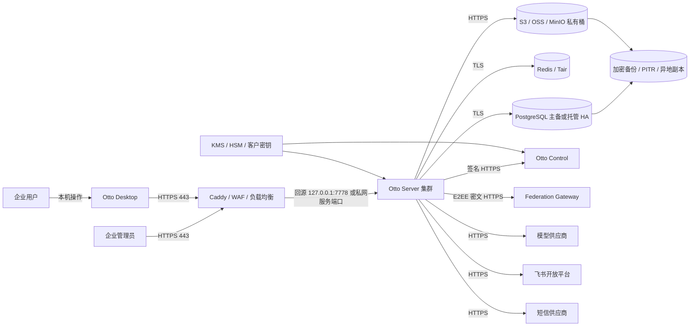

# 01 系统边界与拓扑图

文档状态：`DRAFT`  
适用版本：待填写  
运营主体：待填写  
部署编号：待填写

## 1. 定级对象建议边界

建议把“Otto 企业智能工作系统”作为一个候选定级对象，包含：

- Otto Desktop 客户端及其本机加密数据；
- 对外提供企业认证、组织、协作、知识、Skill、园区、工单和商业控制接口的 Otto Server；
- 反向代理、数据库、共享缓存、对象存储、密钥和备份设施；
- 经批准启用的 Otto Control 与 Federation 接口；
- 与模型、短信、飞书等外部供应商的受控接口。

客户完全独立私有化部署时，客户通常是该实例的系统运营者。Otto 公共服务、多租户平台和各客户独立私有实例是否分别定级，应由运营主体、行业主管部门和测评机构确认。

## 2. 逻辑拓扑

## 3. 网络安全区域

| 区域 | 组件 | 允许的主要访问 | 默认禁止 |
| --- | --- | --- | --- |
| 用户终端区 | Otto Desktop | 访问公开 HTTPS 服务 | 直接访问数据库、Redis、对象存储管理接口 |
| 公网接入区 | Caddy/WAF/LB | `80/443`，管理 SSH 仅堡垒机 | 暴露 Otto Server、PostgreSQL、Redis 内部端口 |
| 应用服务区 | Otto Server | 访问数据区、Control 和批准的外部接口 | 任意出站、匿名管理操作 |
| 数据区 | PostgreSQL、Redis、S3/MinIO | 仅应用身份和备份身份 | 公网访问、共享管理员账号 |
| 安全管理区 | KMS/HSM、审计、监控、堡垒机 | 独立管理员和审计员 | 业务账号读取私钥或改写审计证据 |
| 备份与容灾区 | 备份库、PITR、异地副本 | 备份服务账号、双人恢复 | 生产账号直接删除不可篡改证据 |

## 4. 物理部署图填写项

正式材料必须另附实际部署图，并填写：

- 云厂商、地域、可用区、VPC、子网和安全组编号；
- 公网 IP、域名、证书主体和 CDN/WAF 情况；
- 应用实例、数据库、缓存、对象存储、KMS、监控、堡垒机和备份实例数量；
- 主备关系、故障切换路径、跨可用区与异地备份路径；
- 运维入口、人员来源网段、VPN/专线和客户网络边界；
- 与 Control、Federation、模型、飞书、短信等外部系统的信任边界。

真实地址和安全组规则不得提交公开仓库。正式图应使用内部资产编号，并在受控资产台账中映射到真实值。

## 5. 边界变更触发条件

新增外部供应商、开放新公网端口、启用跨境模型、数据库迁移、单机改集群、新增园区多租户、接入 Federation 或更换 Control 域名时，必须发起边界变更评审，并同步更新拓扑、数据流、端口、资产、权限和供应商清单。
