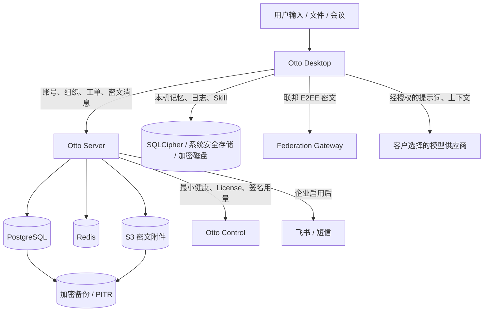

# 02 数据流图与数据目录

文档状态：`DRAFT`  
数据保护负责人：待填写  
数据地域：默认中国境内，实际待核验

## 1. 主要数据流

## 2. 数据目录

| 数据类别 | 示例 | 来源 | 权威存储 | 接收方 | 默认保护 | 建议保留 |
| --- | --- | --- | --- | --- | --- | --- |
| 账号身份 | 姓名、手机号、企业、部门、岗位 | 用户、管理员 | 企业 PostgreSQL/SQLite | Otto Server | 最小权限、TLS、敏感字段加密/哈希 | 账号存续期及法定期限 |
| 认证凭据 | 密码哈希、会话令牌、验证码 | 用户、认证服务 | 企业数据库/缓存 | Otto Server | 强哈希、令牌加密、限流 | 按会话和安全策略 |
| 企业协作 | 组织关系、工单、园区申请、统计 | 员工、园区人员 | 企业数据库 | 所属企业和授权园区 | 租户隔离、角色和作用域校验 | 合同、财务和业务期限 |
| 私聊和附件 | 消息密文、附件密文、路由元数据 | 聊天双方 | PostgreSQL + S3 | 聊天双方、联邦密文中继 | E2EE 候选协议、TLS、附件 ACL | 客户策略或用户删除 |
| 企业知识 | 文档、引用、ACL、版本 | 授权员工 | 企业数据库/对象存储 | 有文档权限的用户和 Agent | 文档级 ACL、审计、TLS | 有效期和业务需要 |
| 个人智能数据 | 记忆、工作日志、自动 Skill | 用户行为和确认 | 本机 + 企业加密同步快照 | 当前账号 | AES-256-GCM、系统安全存储 | 用户控制，注销时删除 |
| 模型请求 | 提示词、上下文、工具结果 | Otto Desktop/Server | 通常不由 Otto 长期保存 | 客户选择的模型供应商 | HTTPS、最小上下文、供应商评审 | 以供应商合同为准 |
| 商业控制 | deploymentId、License、席位、模块、签名用量 | Server/Control | Otto Control | 授权运营人员 | 签名、防重放、RBAC、审计 | 合同和财税期限 |
| 健康遥测 | 版本、运行状态、粗略资源、错误码 | 私有化 Server | 本地队列 + Control | 授权运维人员 | 不含正文、签名传输、可关闭 | 默认 90 天或客户约定 |
| 审计证据 | 操作者、动作、对象、结果、时间、哈希链 | 全系统 | 数据库 + WORM | 安全审计员 | 防篡改、签名、最小披露 | 不少于 180 天，实际待定 |
| 备份 | 数据库、对象、密钥恢复材料 | 生产系统 | 加密备份库 | 备份和恢复角色 | AES-256-GCM、隔离密钥、访问审计 | 默认 30 天且至少 3 份 |

## 3. 外部传输评审表

每个真实部署必须逐项填写，未启用的标记为“不适用”。

| 接收方 | 数据项目 | 目的 | 地域 | 是否包含个人信息 | 合法性基础/授权 | 合同与留存 | 可关闭性 |
| --- | --- | --- | --- | --- | --- | --- | --- |
| Otto Control | License、健康、签名用量 | 授权和运营 | 待填写 | 通常不含正文 | 合同、管理员启用 | 待填写 | 健康遥测可关闭，License 依套餐 |
| 模型供应商 | 提示词及必要上下文 | 模型推理 | 待填写 | 可能包含 | 用户操作、企业制度、必要同意 | 待填写 | 可更换/停用 |
| 飞书 | 消息、文档、身份标识 | 企业协作 | 待填写 | 可能包含 | 企业授权 | 待填写 | 可停用 |
| 短信供应商 | 手机号、验证码/通知 | 认证和通知 | 待填写 | 是 | 认证必要、告知 | 待填写 | 部分流程依赖 |
| Federation | 部署和路由元数据、E2EE 密文 | 跨私有服务器通信 | 待填写 | 元数据可能构成个人信息 | 用户发起、企业启用 | 待填写 | 可停用 |

## 4. 数据流验收

- 抓包确认公网只使用 TLS，未出现口令、Token、私钥或正文的明文传输。
- 检查 Control 遥测不包含聊天、文件、会议、提示词和个人记忆正文。
- 验证不同企业和产业园之间的数据不可越权检索、引用、下载或统计。
- 验证注销、删除台账和备份恢复后的再次删除。
- 对模型、飞书、短信和 Federation 分别保留开关、授权、失败和审计证据。
- 跨境或敏感个人信息处理前完成适用的影响评估和审批。
