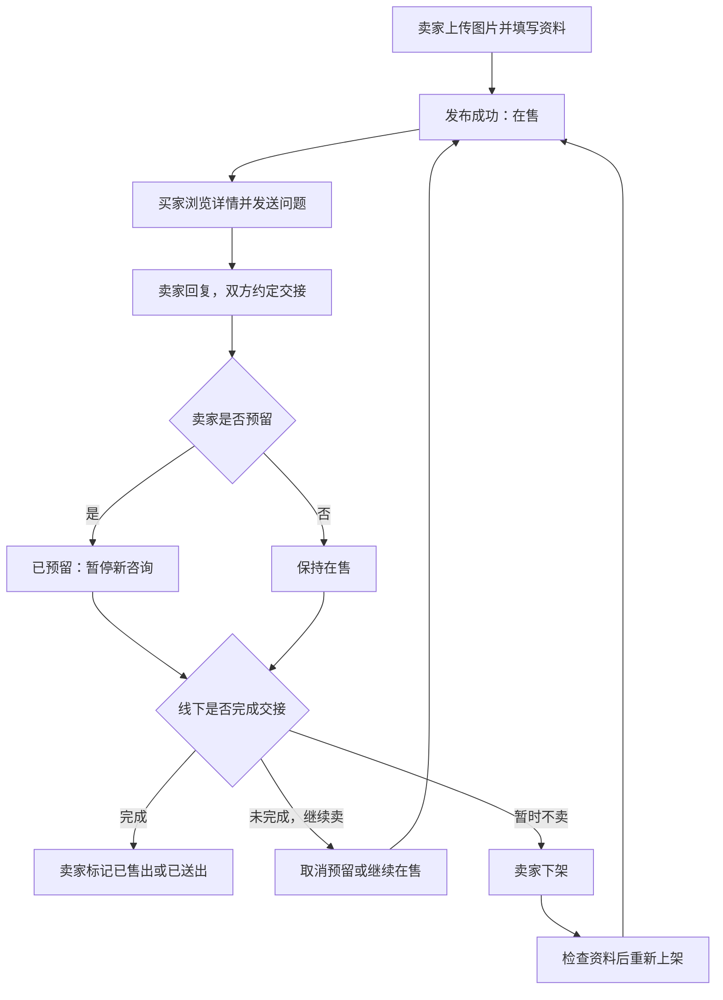

# Otto 园区跳蚤市场产品需求文档

| 项目 | 内容 |
| --- | --- |
| 功能名 | 园区跳蚤市场（园区闲置交易） |
| 作者 | nimbus |
| 版本 | 1.1 |
| 日期 | 2026-09-08 |
| 状态 | 产品评审稿，可用于设计、技术拆解及验收设计；不代表功能已实现 |
| 使用端 | Otto 企业版桌面端，兼容 macOS、Windows |
| 核心范围 | 同园区个人闲置实物发布、发现、咨询、线下交接及发布者自行结束发布 |

> 本文依据本次需求讨论形成，无需重新收集已提供的功能描述。未由用户逐项确定的数值、时限、权限细则均为本稿的建议默认值，统一列于第 16 节；评审通过后作为实现基线。本文不承诺法律结论、平台担保或已验证的交易真实性。

本次修订（v1.1）：补齐预留与有效期、误操作恢复、咨询状态矩阵、按商品历史授权、同物编辑、内容清理、独立管理入口及消息幂等；新增功能状态、私有预留备注和会话关联商品列表。新增默认值同样列入第 16 节，作为设计与实现基线。

## 1. 需求描述与概述

### 1.1 背景

园区成员希望把不用的显示器、椅子、图书等物品转让给附近的人。已有线下群聊的信息容易被刷走，商品是否还在售不明确，图片和价格散落在消息中，约好交接后仍可能收到重复咨询。

本功能提供持续可查的商品信息及联系入口。买卖双方自主协商，在园区附近看货、交接和付款；发布者自行预留、下架或标记已售出。

### 1.2 产品目标

1. 卖家能够快速发布含实拍图片的闲置，离开页面后仍能收到咨询。
2. 买家能够判断商品是什么、多少钱、哪里取、是否还在卖，并直接提出问题。
3. 已约交接、暂时不卖、已经卖掉分别有明确状态，减少无效咨询。
4. 图片、商品及消息遵循园区访问范围，同园区跨企业联系形成真实闭环。
5. 卖家随时能够结束自己的发布，管理员能够处理违规信息。

### 1.3 核心原则

- 联系不等于购买，收藏不等于联系，预留不等于成交。
- 已售出表示发布者的自行声明，不表示平台核实付款或交付。
- 一条发布对应一个出售单位，可以是单件或整套，不在首发引入库存和拆单。
- 点击按钮但尚未发送消息，不通知对方、不创建购买承诺。
- 关闭窗口、移除首页模块不改变商品状态。
- 失败时保留用户输入；状态变化必须有可理解的结果，不以内部日志替代提示。

### 1.4 项目现状与依赖

仓库已有园区归属、企业账号、园区模块、私信和部分通知基础。本次检索及仓库既有分析未发现闲置交易专用实现；技能市场不是二手物品市场。既有聊天不等于已经支持同园区跨企业陌生咨询。

本功能须作为园区业务模块实现，不放入 Agent 运行时内核，不套用报修工单。图片存储、访问授权、同园区消息请求、状态通知均是正式交付依赖。未达到依赖验收条件时，不能仅开放一个“联系卖家”空入口。

参考：[园区业务分析](../research/2026-09-08-park-customer-code-analysis.md)、[产品模块边界](../product-modules.md)、[运行时边界](../runtime-kernel-boundary.md)。引用文档中的实现判断可能随代码更新，开发前重新核对。

## 2. 用户、权限与范围

### 2.1 用户需求

| 用户 | 场景与需求 | 成功结果 |
| --- | --- | --- |
| 发布者 | 清理个人闲置，不想反复解释商品情况 | 图片和说明一次发布，多人可查；咨询带商品上下文 |
| 买家 | 想在附近找到价格合适的物品 | 看懂价格和状态，能联系并约定交接 |
| 免费赠送者 | 不收费，希望有人方便取走 | 明确免费，由本人选择接收者 |
| 园区管理员 | 减少广告、违规和骚扰 | 能查看举报、限定范围处理并通知当事人 |

### 2.2 可用性与权限矩阵

| 身份 | 浏览公开商品 | 发布/联系/收藏 | 管理本人记录 | 内容治理 |
| --- | --- | --- | --- | --- |
| 本园区有效成员 | 可以 | 可以，受限额及屏蔽规则约束 | 可以 | 举报 |
| 本园区授权市场管理员 | 可以 | 作为普通成员使用 | 仅本人发布 | 查看举报、移除/恢复、限制发布 |
| 其他园区成员 | 不可以 | 不可以 | 仅本人原园区私有历史，不能原园区上架 | 不可以 |
| 已退出园区但账号仍有效 | 不可以 | 不可以 | 可读本人历史、删除；不能原园区重新上架 | 可对本人已有处理记录申诉 |
| 未登录/停用账号 | 不可以 | 不可以 | 登录恢复或账号恢复后再按权限判断 | 不可以 |

企业普通管理员不会因管理本企业而自动拥有员工商品编辑权。园区市场管理员不能冒充卖家修改价格或标记成交。账号、园区和授权由服务端确定，不接受客户端自报园区作为权限依据。

### 2.3 首发范围

首发包含：入口与权限、市场列表、搜索筛选、商品详情、图片发布和草稿、编辑、收藏、带问题的联系请求、已有会话继续沟通、我的发布、预留/下架/售出、重新上架、消息提醒、有效期管理、举报、屏蔽、最小管理工作台。

暂不包含：线上支付、定金、担保、订单、物流、售后退款、交易评价、竞拍、批量库存、商家店铺、企业资产处置、跨园区交易、公开评论、求购、AI 估价/自动发布。免费送属于首发，不引入抢购或先点击者自动获得。

手机扫码传图、AI 草稿、求购和收藏降价通知为后续功能。首发明确支持桌面文件选择、拖拽、粘贴，并提示“请先将手机照片传到电脑”，不展示尚不可用的扫码按钮。

## 3. 页面设计与导航

### 3.1 信息架构

园区服务 → 跳蚤市场 → 市场 / 我的收藏 / 我的发布。

统一消息入口 → 商品咨询 / 系统通知 → 对应会话或商品记录。

个人中心 → 我的发布记录 → 按原园区分组的本人发布、草稿、处理记录和申诉。该管理入口不依赖首页模块是否存在、市场是否启用或本人是否仍属于原园区；账号有效即可进入，动作仍按当前权限判断。退出园区者可查看本人保留文本、删除允许删除的记录和申诉，不可浏览原市场、获取原园区商品图片或重新上架；停用账号不得访问。市场内的“我的发布”复用同一管理能力。

园区管理 → 跳蚤市场管理 → 举报列表 / 商品处理 / 发布限制 / 配置。

### 3.2 页面要求

| 页面 | 主要布局和元素 | 导航与关闭 |
| --- | --- | --- |
| 市场首页 | 园区名、搜索框、分类、筛选、排序、发布按钮；响应式图片卡片列表 | 详情返回后保留搜索、筛选和滚动位置 |
| 商品详情 | 左侧图片/缩略图，右侧标题价格状态；下方说明、交接、卖家；联系/收藏/分享/举报 | 窄窗口改为单列；自己的商品改为管理按钮 |
| 发布/编辑页 | 图片、基本信息、交接信息、可见范围提示、保存状态、预览和发布 | 有未保存内容时提供保存草稿并退出、继续编辑、放弃本次更改 |
| 我的发布 | 在售、已预留、已下架、已售出、草稿、已移除；各状态计数 | 按最近管理操作排序；操作后卡片移至目标分类 |
| 我的收藏 | 商品卡片、状态、取消收藏 | 失效卡不无故消失；权限失效时只显示不可用占位 |
| 咨询页面 | 对方身份、商品上下文卡、关联商品列表、消息历史、输入框、屏蔽/举报 | 与统一消息入口衔接，不另造孤立消息箱 |
| 管理工作台 | 举报原因、证据、状态、处理历史及操作 | 每项处理显示执行人、时间、原因 |

### 3.3 通用交互

- 标准窗口支持键盘顺序导航，焦点可见，弹窗关闭后焦点回到触发按钮；状态不能只靠颜色表达。
- Esc 关闭最上层图片预览或弹窗；编辑页有未保存内容时先显示退出选择。后台任务不因关闭弹窗重复提交。
- 加载展示骨架；读取失败展示重试；空结果和无权限必须使用不同文案。
- 破图显示占位和“图片暂时无法加载”，可重试，不挤压卡片布局。
- 商品状态变化后刷新当前按钮；提交动作前仍由服务端校验，不能依赖页面此前看到的状态。
- 通用成功提示约 3 秒消失；失败及需要用户处理的信息保留。破坏性删除需二次确认，普通收藏/下架不反复确认。

## 4. 用户旅程

### 4.1 正常出售

1. 卖家从园区进入市场，点击发布，选择照片并补充商品资料。
2. 校验通过后点击发布；按钮进入处理中，成功进入真实商品详情。
3. 买家搜索到商品，放大图片、阅读瑕疵，点击联系并发送问题。
4. 卖家收到带问题和商品卡的消息请求，回复，双方约定交接。
5. 卖家手动设为已预留，其他买家看见状态但不能新增该商品咨询。
6. 线下完成交接和付款，卖家标记已售出，商品退出市场发现列表。
7. 原有会话及授权记录仍能查看，不要求买家确认收货。

### 4.2 预留后未成交

约定时间到了 → 系统提醒卖家处理 → 对方未到，卖家取消预留 → 恢复在售。系统不自动分配给其他买家，不自动指责或处罚爽约者。

### 4.3 暂时不卖与重新上架

卖家下架 → 市场不再展示 → 原会话仍可继续 → 从我的发布修改后重新上架。原链接及收藏关联仍保留，显示最新状态。

### 4.4 免费送

选择免费送 → 价格显示“免费送” → 多人可咨询 → 发布者自行选择接收者 → 预留 → 交接后标记“已送出”。内部与已售出使用同一结束状态，文案按出售方式区分。

### 4.5 中断、离线与身份变化

上传失败保留表单 → 重试失败图片 → 网络恢复继续发布；消息发送失败保留输入并允许重试。退出园区后原园区商品停止展示，本人有效账号仍能管理私有历史，不随账号转园区自动搬到新市场。

## 5. F01 市场入口与商品发现

**需求描述：** 买家快速找到附近仍然有效的商品，并知道当前市场范围。

**相关页面设计：** 市场首页、搜索结果、商品卡片。

**用户故事：** 作为园区成员，我希望只看本园区商品；作为买家，我希望能按价格和类别缩小范围。

**实现逻辑与功能细节：**

1. 功能可用需同时满足企业版、账号有效、园区有效、成员有效、市场已启用和对应服务能力就绪。隐藏入口不替代接口鉴权。
2. 默认包含在售和已预留商品，按本次上架时间倒序；预留卡显示明显标识。支持“只看未预留”。已下架、已售出、管理员移除和草稿不进入发现列表。
3. 卡片包含封面、标题（最多两行）、价格或免费送、交接区域、状态、上架相对时间。没有原价信息则不展示折扣和划线价。
4. 分类：数码电子、办公用品、家居生活、运动户外、图书、其他；不因类别不同增加大量必填项。
5. 搜索匹配标题及描述，去除首尾空白；支持回车或搜索按钮。输入最多 50 字，不做未经确认的自动纠错。清空搜索后回到保留筛选条件的列表。
6. 筛选包括分类、最低/最高价格、免费送、只看未预留。最低价大于最高价时就地提示，不提交。选择免费送时禁用价格区间并清空区间，取消免费送不恢复旧区间。
7. 排序：最新发布、价格从低到高、价格从高到低；免费视为 0，价格相同按上架时间倒序，再按稳定 ID 排序。修改描述和确认在售不刷新上架时间。
8. 每批 20 条，点击加载更多；失败保留已加载内容。并发更新不能出现重复卡片；不承诺一次请求遍历全部商品。
9. 空市场显示“园区还没有闲置，发布第一件吧”；无搜索结果显示“没有找到符合条件的商品”，提供清除筛选。不得把跨园区商品作为补量展示。
10. 浏览者点击自己的商品，显示编辑和状态管理，不出现联系自己。

## 6. F02 图片上传、草稿与发布

**需求描述：** 发布者用少量信息准确介绍商品，任何中断都尽量不丢输入。

**相关页面设计：** 发布页、图片放大预览、发布前预览、草稿列表。

**用户故事：** 作为卖家，我希望拖入照片就能开始填写，关闭后还能接着编辑。

### 6.1 字段定义

| 字段 | 必填 | 规则/默认值 | 错误反馈 |
| --- | --- | --- | --- |
| 图片 | 是 | 1–9 张，每张不超过 20 MB；JPEG、PNG、WebP、HEIC/HEIF；后两种手机格式需服务端或客户端可靠转码 | 指明具体文件的格式、大小或解码问题 |
| 标题 | 是 | 去首尾空白后 2–40 个可见字符 | 标题过短/超过 40 字 |
| 分类 | 是 | 单选，无默认选中 | 请选择分类 |
| 出售方式 | 是 | 默认出售，可改免费送 | 切换免费后隐藏价格与可议价 |
| 价格 | 出售必填 | 0.01–999999.99 元，最多两位小数；不接受负数、科学计数法或“面议” | 免费请切换免费送；其他问题提示有效范围 |
| 可议价 | 否 | 默认关闭 | 不构成卖家接受任何报价的承诺 |
| 成色 | 是 | 未使用、几乎全新、有使用痕迹、明显使用痕迹 | 请选择最符合实际情况的一项 |
| 功能状态 | 是 | 正常、存在故障、未测试；无默认选中，与外观成色独立 | 请选择功能状态；选择故障时必须说明具体问题 |
| 描述 | 是 | 5–2000 个可见字符，纯文本，保留换行；存在故障时另填 2–500 字故障说明并公开展示 | 提示配件、瑕疵及单件/整套；大件提示尺寸、拆装、自行搬运和可取时间，不增加类别专属必填项 |
| 交接区域 | 是 | 园区公共点位单选；或手填 2–50 字区域名 | 不要求地图定位，不填写精确办公室/住宅门牌 |
| 交接时间 | 否 | 自由文本，最多 100 字 | 如“工作日午休或 18 点后” |
| 发布者/园区 | 自动 | 当前有效账号及当前园区 | 用户不能在表单冒用其他身份 |

字符长度按用户可见字符计数，前后端规则一致；不把一个表情拆成多个剩余字数。免费切回出售时恢复本次编辑内原价，但必须由用户检查后提交。价格在持久化时使用整数分。

### 6.2 图片交互

1. 支持文件选择、拖拽和剪贴板粘贴，合并执行 9 张上限。一次超量时按文件选择顺序接收剩余名额并提示哪些未加入。
2. 每张单独显示等待、上传进度、成功或失败；失败可重试/删除。其他成功图片不重传。
3. 第一张为封面，支持拖动排序及“设为封面”操作；删除封面后下一张补位。上传后可以放大，首发不做复杂修图。
4. 修正照片方向，去除 EXIF 定位等元信息，生成封面缩略图和详情展示图，保留看清瑕疵的分辨率。禁止未经鉴权的永久公开图片链接。
5. HEIC/HEIF 转码失败明确提示换用 JPEG/PNG，不悄悄丢图。该格式的双端验收属于首发要求，不能以文件选择器接受后缀代替成功支持。
6. 图片检查通过前不能正式发布；仅上传成功但解码/内容检查失败时仍算失败。采用文件实际格式和资源限制校验，不能只检查后缀。
7. 发布按钮在有上传中或失败图片时不可提交，旁边显示原因。用户删掉失败图且满足至少一张后可以继续。

### 6.3 草稿和提交

1. 停止输入 1 秒后保存到当前账号本机草稿；成功上传的附件 ID 可恢复。草稿不承诺跨设备同步，未成功上传的本地文件重启后可能要求重新选择，文字仍保留。
2. 草稿最多 20 条，不自动删除最旧内容；超限时提示管理草稿。明确显示“已保存到本机”或“草稿保存失败”。退出账号后其他账号不可读取。
3. 保存成功可直接关闭；仍在保存/上传时退出显示三个操作：保存草稿并退出、继续编辑、放弃本次更改。失败时不得宣称已保存。
4. 发布前可预览；预览不产生公开链接或通知。页面常驻“仅本园区成员可见，交易由双方线下协商”。
5. 发布按字段顺序校验，将焦点移至首个错误。提交中禁用重复提交，成功后进入详情，清理对应草稿并提示“发布成功”。
6. 网络超时且结果未知时显示“正在确认发布结果”，使用同一请求标识查询或重试；不得引导用户直接新建造成重复商品。
7. 同时在售与预留最多 20 条，每园区自然日最多成功发布 10 次（新建、售出后再次发布以及正式重新上架均计入）；下架后重新上架另受第 10 节频率限制，不能靠反复下架刷榜。到达上限保留草稿并显示具体原因。

## 7. F03 商品详情、收藏与分享

**需求描述：** 买家有足够信息判断是否咨询，并可稍后返回。

**相关页面设计：** 详情页、图片查看器、收藏列表。

**用户故事：** 作为买家，我希望看清照片和瑕疵，收藏时不打扰卖家。

**实现逻辑与功能细节：**

1. 详情显示全部图片、标题、价格、是否可议价、成色、功能状态、故障说明（如有）、描述、交接区域/时间、上架时间及最近确认在售时间。预留时只显示已预留，不公开接收者或私人约定。
2. 卖家默认展示头像、昵称和“同园区成员”，不强制展示公司、职位、实名或电话，不展示未经事实支持的信用分/成交率。
3. 图片预览支持上一张/下一张、缩放、Esc 退出；键盘左右键切图，显示当前张数。
4. 收藏为私有关系，重复点击幂等；卖家不收到收藏通知，不看到收藏者。网络失败恢复按钮原状态并提示失败。
5. 收藏中的已下架/已售出保留状态卡并允许取消；已删除/移除/无权限不暴露原图片及说明，只显示不可用占位。收藏不授予下架商品的完整历史读取权。
6. 分享复制内部商品链接并显示“链接已复制，仅本园区成员可查看”；不自动调用外部软件发送消息。接收者无权限时显示“该商品仅限原园区有效成员查看”，不泄露标题图片。
7. 已预留详情可查看及收藏，但新咨询按钮禁用并注明原因；已有该商品咨询关系的用户仍可进入原会话。
8. 普通访问者打开已下架/已售出链接，只显示终止状态和返回市场按钮；发布者、具备该商品历史授权的咨询参与者按第 8.4 节查看记录。已删除或治理移除的图片内容不通过历史授权继续公开。

## 8. F04 联系卖家与消息

**需求描述：** 同园区跨企业成员能够从商品建立联系，第一条消息就说明来意，同时控制骚扰。

**相关页面设计：** 首次咨询输入区、消息请求、统一私聊、商品上下文卡。

**用户故事：** 作为买家，我希望直接问“椅子高度可以调吗”；作为卖家，我希望在决定回复前就知道对方问什么。

### 8.1 发起与接受

1. 点击联系仅打开输入区，不自动发送。可提供“还在吗？”快捷填入项，仍须用户点击发送。
2. 首次问题 1–500 字，自动附商品卡。发送瞬间校验商品在售、双方园区资格、屏蔽、联系限额和商品版本。
3. 若浏览后商品已预留/下架/售出，发送失败，保留输入并刷新状态；用户可复制内容，但系统不绕过限制发送。
4. 双方尚无可用会话时创建一条带问题的请求。卖家可回复（同时接受）、接受后稍后回复、忽略、屏蔽、举报。忽略不向买家暴露拒绝理由。
5. 待处理请求期间，发送者不可连续追加消息，可撤回；接受或首次回复后进入正常聊天。7 天未处理自动到期，买家看到“请求已到期”。忽略后的发送者仍看到未获回复，直至同一期限到期。
6. 已有获授权的一对一会话时复用，插入新商品快照和问题，仍校验本次商品的在售、版本、成员资格及市场屏蔽；商品咨询授权不得扩展为读取对方企业目录或其他业务信息。
7. 同一园区同一对账号最多一个待处理请求/一个市场会话，反向发起时复用已有请求并允许接受；不生成双会话。待请求期间换商品，提示等待回复或先撤回旧请求。
8. 同一商品同一方向请求到期/撤回后，至少距离上次发送 24 小时才可再发；每日最多向 10 位卖家发起首次请求，单卖家单日最多 1 次。回复和已有会话消息按基础消息频控处理。

### 8.2 商品卡与历史

1. 发出时固化商品标题、价格、出售方式、封面引用、商品版本和时间。之后改价不静默修改旧卡。
2. 卡片独立显示当前状态及“商品信息已更新”；点击查看当前详情，历史报价只代表当时发布内容，不构成平台合同或成交证明。
3. 已建立会话中，商品后来下架/售出不停止聊天；预留也不妨碍原咨询双方交流。不向所有咨询者自动发送销售承诺或失败通知。
4. 待处理请求的状态变化按第 8.3 节执行；失效不是删除已送达的问题。已建立会话与待处理请求明确区分。
5. 屏蔽后双方不得通过其他商品重新建立联系，历史只读；解除屏蔽不自动补发期间的消息，也不自动复活失效请求。
6. 园区成员身份失效后，该园区授予的市场联系能力停止；账号有效者可读本人历史文本，原园区商品图片访问终止。若双方另外具有合法的企业私聊授权，按原私聊规则处理，不全局关闭已有私聊。
7. 未读持久化，多设备同步已读；请求、普通消息、商品通知分类型显示。系统桌面提醒服从用户设置，退出客户端不承诺收到系统弹窗，重新登录可查看站内记录。
8. 首次请求不允许另加附件，正常会话附件沿用已验收的消息能力；不能假定任意附件已支持。

### 8.3 咨询请求状态与重试

以下“已有会话”指已接受请求或已获得独立私聊授权的会话；忽略是接收者侧隐藏操作，原请求到期时间不变，可从请求记录重新打开。多条件同时成立时，账号停用、成员资格和屏蔽等限制优先；商品恢复不能解除这些限制。

| 事件 | 待处理请求 | 已有会话及用户反馈 |
| --- | --- | --- |
| 商品预留 | 保留，可接受/回复，原 7 天到期时间不变 | 原咨询可继续；禁止其他商品入口绕过该商品的新咨询限制 |
| 主动下架、到期下架或标记售出 | 立即终止，不再接受/回复；保留已送达问题 | 原会话继续；双方请求记录显示“商品已下架/售出，本次请求已结束” |
| 商品删除或管理员移除 | 立即终止；保留允许保留的文本，隐藏商品图片与详情 | 已有会话不因商品移除自动关闭；若有独立联系限制则执行限制 |
| 园区暂停市场 | 暂停接受/回复；请求仍按原时间到期 | 已有会话依授权继续；显示市场暂停，不宣称请求已接受 |
| 园区恢复市场 | 仅原请求尚未到期且商品在售/预留、双方有资格时恢复处理入口 | 不恢复其他原因已终止的请求 |
| 一方园区身份失效、账号停用或双方存在市场屏蔽 | 请求立即终止；另一方仅显示当前无法联系，不披露人事或屏蔽原因 | 市场联系停止；账号有效者按历史权限读取，独立私聊按第 8.4 节处理 |
| 发送者撤回或请求满 7 天 | 撤回/到期为终态，不再接受；已送达记录按保留规则留存 | 接收者看到已撤回/到期，不再显示可回复按钮 |
| 误下架恢复、撤销售出、解除屏蔽或撤销治理 | 不自动复活终止请求，不自动补发 | 买家主动重发时重新检查商品状态、资格、冷却及额度 |

有待处理请求时，下架按钮旁常驻提示“下架将结束 N 条待处理咨询，已有聊天不受影响”；操作后提供查看已结束请求入口。恢复商品只恢复发布，不承诺恢复咨询。接受与终止并发以服务端原子提交顺序为准，不能出现成功接受但会话未创建的中间结果。

发送第一条问题时生成并保留客户端请求标识；创建请求、写入问题及商品卡、登记商品历史授权、计入限额、生成通知事件作为同一次可靠提交。已有会话插入新商品咨询也适用。超时显示“正在确认发送结果”，查询或使用同一标识重试；已成功则返回原记录，即使商品此后下架也不再次发送；未成功则按最新状态校验。重复提交只计一次额度和一次通知，同一标识携带不同内容应拒绝。只有明确未成功并由用户修改后再次发送，才生成新标识；服务重启和跨节点重试也必须成立。

### 8.4 按商品授权与关联商品

- 历史授权以“园区＋商品＋账号＋成功咨询记录”为依据。成功送达的请求（含待处理、忽略、撤回、到期及随后因状态变化终止）和已有会话中成功发送的该商品咨询均保留该商品历史关联；发送失败、仅打开输入框、收藏或仅有双方会话不授予历史详情权限。
- 双方仍为有效同园区成员且商品未删除/治理移除/内容清理时，上述参与者可查看该商品当前保留详情，即使已下架/售出。这里不承诺回看每一版完整描述；发送时快照按第 8.2 节固定保存，管理员举报证据另外固定到被举报版本。
- 商品删除或治理移除后，咨询者仅见历史问题、允许保留的快照文字和终止状态，不见原商品图片及详情；成员资格失效后原园区商品图片和详情权限撤销，账号有效者可读本人的历史消息文本。屏蔽本身停止联系，不抹除原有商品历史授权；其他撤权条件仍生效。
- 复用企业会话不授予卖家其他商品的历史查看权。存在独立企业私聊授权时，市场屏蔽只禁用市场请求、新商品卡发送和市场联系入口；基础私聊按其原权限及独立屏蔽规则运行。屏蔽确认必须说明其作用范围，不能声称对方在所有渠道均无法联系。
- 会话内提供“关联商品”列表，按最近成功咨询时间排序，同商品去重；只列该会话真正涉及且当前允许展示的记录，可定位原消息。失效记录按文字占位展示，不列卖家的所有发布，也不自动创建购买/订单关系。

## 9. F05 我的发布、编辑和状态管理

**需求描述：** 发布者随时掌握和结束自己的商品发布，动作符合现实中的出售阶段。

**相关页面设计：** 我的发布各分类、本人详情操作栏、预留设置、删除确认。

**用户故事：** 作为卖家，我希望约好交接时能停止新咨询，也能在对方没来时恢复出售。

### 9.1 状态与权限

| 状态 | 市场可发现 | 新咨询 | 发布者主要动作 |
| --- | --- | --- | --- |
| 草稿 | 否 | 否 | 编辑、发布、删除草稿 |
| 在售 | 是 | 是 | 编辑、设为预留、下架、标记售出 |
| 已预留 | 是，明显标记 | 否 | 编辑、取消预留、下架、标记售出 |
| 已下架 | 否 | 否 | 编辑、重新上架、标记售出、删除 |
| 已售出/已送出 | 否 | 否 | 查看、误操作撤销、再次发布、删除 |
| 管理员移除 | 否 | 否 | 查看原因、申诉、隐藏本人列表记录 |
| 已删除 | 否 | 否 | 无恢复入口；已有消息按保留规则处理 |

### 9.2 编辑

在售、预留、下架均可编辑，编辑时公开信息保持原版本，保存成功一次更新所有字段。失败不局部更新。预留时改价格/出售方式提示“请与已约定的人重新确认”，不会自动取消预留，也不替卖家通知买家。

编辑副本与公开状态分离：编辑期间另一设备下架、售出或管理员移除，保存返回冲突，保留本地输入并展示最新状态，不重新激活商品。已售出不能直接编辑，可使用再次发布创建草稿。

同一商品 ID 始终对应同一出售单位，不能通过编辑换成另一件物品并沿用收藏和咨询。编辑页常驻“更换物品请另发一件”及创建独立新草稿入口。分类改变或原图全部替换时，保存前必须确认仍为同一物品；选择更换则转入新草稿，原发布不变。首发不承诺自动识别所有换物行为，其他标题/描述更改也受同物规则约束。编辑保留版本关系，举报提交时固定被举报版本及必要证据，不能被后续编辑覆盖。

### 9.3 预留

在售点击“设为预留”打开小弹窗：说明“暂停新的咨询，已有聊天不受影响”；可选预计交接时间，默认不设置。允许选择未来 30 天内时间，以园区时区展示。确认后变为预留，成功提示“已预留”。不绑定买家、不收取定金、不按先联系顺序分配。

预留弹窗同时展示商品到期时间。预计交接时间达到或晚于当前到期时间时，不能直接提交，提供“确认继续出售并预留”：明确告知有效期延至本次确认起 30 天，原排名不变；服务端一次性完成续期及预留，并要求交接时间严格早于新到期时间。用户不选择续期时可调整时间或退出，不静默续期。

预留后可直接修改预计交接时间或清除时间，不必取消预留；时间变化创建新的提醒版本并使旧提醒失效，不短暂开放新咨询。设有时间时，到时只提醒一次处理；未设时间时从本次设置/清除时间起 3 天后提醒一次。不修改时间的普通编辑或备注修改不重置提醒。

增加仅发布者本人可见的预留备注，选填、最多 200 字，用于记住约定对象和交接事项，不向买家、商品卡、分享或通知暴露，不自动绑定买家或发消息。结束预留时清空该备注，另一次预留不自动带入；不计入聊天和举报快照。

取消预留前检查最新身份、限制、市场启用及有效期；符合条件才立即恢复在售，无二次确认，原上架及到期时间不变。已到期则执行到期下架并解释原因，不短暂回到在售。下架、售出、删除或移除均结束当前预留周期并取消其提醒。自动下架只结束公开发布，不代表双方私下的交接约定已取消；相关提示明确说明需自行联系确认。

### 9.4 下架

点击“暂时下架”立即处理，不强制填写原因，提示“已下架，可在我的发布重新上架”。已有聊天保留；公共详情退出公开展示。可以通过重新上架恢复，不在首页移除模块时自动下架。

下架商品线下卖掉后仍可标记已售出，避免要求用户先重新上架。

### 9.5 售出与撤销

点击“标记已售出”（免费对应“标记已送出”）确认弹窗：说明“将停止展示和新增咨询；无需买家确认”，按钮为取消/确认。无需买家账号、付款证明和评价。

误操作撤销窗口为 24 小时：从下架标记售出的撤销回到下架；从在售/预留标记售出的撤销回到在售，并提前提示原预留不会恢复。撤销不刷新原上架时间和到期时间；拟恢复为在售但原有效期已结束时，提前说明并恢复为已下架，需主动重新上架。拟恢复在售时重新检查市场启用、资格、在售上限及限制；失败保持售出并给出原因，可由本人另选恢复为下架，不能因此越过管理员移除等最新状态。超过窗口使用“再次发布”，复制到新草稿、产生新 ID，不自动沿用旧收藏/聊天上下文关系。

### 9.6 删除

在售/预留先下架再删除，避免与临时停售混淆。删除确认说明“该发布无法恢复；不会删除对方已有聊天”。草稿直接删除需确认。管理员移除记录只能从本人列表隐藏，不抹去治理和申诉记录。

卖家删除后公开商品图片失效，已有聊天中的历史商品卡变为文字状态卡；历史消息文本按消息保留规则处理。界面不得承诺“删除所有人的全部记录”。

## 10. F06 有效期、重新上架与通知

**需求描述：** 商品长期有效性可判断，卖家忘记更新时有温和提醒。

**相关页面设计：** 我的发布有效期提示、统一通知、确认在售动作。

**用户故事：** 作为买家，我不想反复问到早就卖掉的商品；作为卖家，我希望续期只需一次点击。

**实现逻辑与功能细节：**

- 在售/预留有效期 30 天，从发布、重新上架或主动确认继续出售开始计算；普通编辑不延长。
- 到期前 3 天站内提醒一次：继续出售、已售出、下架。继续出售校验市场启用、成员资格和限制，保留当前在售/预留状态，将到期时间设为本次确认起 30 天，不在旧到期时间上累计，不刷新列表排名。
- 到期自动下架，原因记录为超期未确认，发送结果通知；不自动删除，不默认已售出。预留也适用，同一时刻的预留提醒与到期处理以实际最新状态为准。
- 重新上架保留商品 ID，检查完整字段、图片有效性、园区身份、管理员限制和在售额度，刷新本次上架时间并开始新有效期。同一商品按滚动 24 小时最多一次重新上架，与园区自然日发布额度分别检查。仅本人主动下架且距离该次下架不足 24 小时、期间无再次编辑/上架或其他状态变更时，可选择“恢复误下架”：校验市场启用、成员资格、管理员限制、在售额度及图片有效性，原有效期未结束才恢复在售；保留原上架时间和到期时间，不刷新排名、不消耗发布额度。原预留不恢复并提前提示。到期、身份失效、发布限制或治理恢复产生的下架不适用；不满足条件则说明原因并走正式重新上架。
- 园区暂停市场：停止发现、发布和新咨询，现有会话依授权继续；卖家仍能下架/结束自己的记录。有效期继续计时，重新启用不自动恢复已下架商品。
- 园区成员失效：立即停止相关商品公开访问并转下架，不能靠续期维持原园区在售。

| 事件 | 接收者 | 内容和跳转 | 去重 |
| --- | --- | --- | --- |
| 新咨询/回复 | 对方 | 对应请求/会话 | 消息 ID |
| 预留时间到/无时间预留满 3 天 | 卖家 | 去处理该商品，不附私有备注 | 商品＋预留周期＋提醒版本 |
| 即将到期 | 卖家 | 继续出售/结束发布 | 商品＋有效期版本 |
| 自动下架 | 卖家 | 下架原因、去我的发布 | 商品＋状态版本 |
| 治理移除/恢复/申诉结果 | 卖家 | 原因及处理记录 | 处理事件 ID |
| 举报受理/结果 | 举报者 | 已受理/已处理/未发现违规，不公开对方隐私 | 举报 ID＋阶段 |
| 结束发布内容即将清理 | 账号有效的卖家 | 提前 7 天说明清理范围，跳转本人记录；不自动续期 | 商品＋本轮保留截止时间 |

收藏、普通浏览、复制链接不通知卖家；首发不发送降价群发提醒。通知打开后已过时，展示当前状态，不继续执行旧动作。定时任务和通知需要服务端持久化、重试、去重，不能依赖用户保持桌面在线。

## 11. F07 举报、屏蔽与管理

**需求描述：** 用户能够退出不舒服的联系，管理员能处理内容问题且过程可追踪。

**相关页面设计：** 商品/消息举报弹窗、屏蔽确认、管理工作台、申诉页。

**用户故事：** 作为成员，我希望举报虚假商品；作为发布者，我希望知道被移除的原因。

**实现逻辑与功能细节：**

1. 举报原因：信息不实、广告/非个人闲置、疑似诈骗、不适宜物品、骚扰、其他；其他必填说明，说明最多 500 字，可附最多 3 张截图，每张遵循图片上传限制。
2. 提交前明确“将向园区市场管理员提供该商品及你选择的证据”。消息举报只提交所选消息及用户主动提供的上下文，不开放全部私人会话。
3. 同人同对象已有未处理举报时显示已提交，不反复建单；提交成功提示已受理，不承诺未经运营确认的处理时限。
4. 管理员在本园区查看举报快照、原因、证据和必要身份，状态为待处理、处理中、已处理。操作包含无违规结案、移除商品、限制发布、恢复资格；均记录原因。
5. 严重违规可以直接移除，无需等待卖家同意；卖家收到具体原因，可提交一次待处理申诉，说明最多 1000 字及最多 3 张图片。申诉被处理后可以补充新证据再次提交，不允许并行刷单。
6. 管理员撤销移除后，商品恢复为已下架，由卖家检查后主动上架；不自动回到市场，也不恢复已失效的咨询请求。
7. 发布限制需设置原因和结束时间（或明确永久），阻止新建和上架；已有在售商品转下架，已有会话是否限制单独处理，不能以限制发布静默关闭所有聊天。
8. 屏蔽是双向的市场联系限制；被屏蔽者收到一般性不可联系提示，不暴露屏蔽人。屏蔽不自动下架商品、不删除聊天、不等于提交举报。
9. 运营须提供园区内清晰可见的允许/禁止发布规则、处理联系人和责任人。首发定位个人闲置实物，禁止明显广告、冒用图片及规则明确禁止的物品。具体物品政策由运营确认，本稿不把某份外部政策当成已通过的法律结论。
10. 首发采用发布校验＋举报后处理，不引入所有商品人工预审队列；如运营要求预审，应增设待审核/驳回状态并整体更新流程，不能后台静默延迟显示。

## 12. 实现逻辑与数据约束

### 12.1 产品对象

| 对象 | 最小信息 |
| --- | --- |
| 商品 | ID、园区、发布者、版本、标题分类成色描述、功能状态/故障说明、出售方式/分单位价格、交接信息、状态、下架原因、创建/上架/确认/到期/售出/删除时间、预留时间/私有备注/提醒版本、内容清理状态/时间 |
| 图片 | 附件 ID、所有者、所属商品/草稿、顺序、封面、格式尺寸、转码检查状态、访问策略 |
| 编辑草稿 | 本机账号、草稿 ID、来源商品及版本、字段、成功附件引用、保存状态；服务端仅登记账号所属草稿附件引用及最后续租时间，不承诺字段跨设备同步 |
| 收藏 | 用户、商品、收藏时间；唯一约束 |
| 联系请求 | 园区、双方、来源商品/快照、首条问题、状态、到期时间、请求标识 |
| 市场会话关联 | 参与者、基础会话 ID、授权来源、涉及商品、授权起止；每商品每账号的历史关联及成功咨询依据 |
| 状态历史 | 商品、前后状态、操作者、原因、时间、版本、撤销来源 |
| 治理记录 | 举报及证据、处理人、决定、申诉、发布限制 |
| 通知 | 事件 ID、收件人、对象版本、类型、跳转目标、已读/投递状态 |

### 12.2 状态转换约束

- 发布：草稿 → 在售；预留：在售 → 已预留；取消预留：已预留 → 在售。
- 主动/到期/身份原因下架：在售或已预留 → 已下架。
- 重新上架：已下架 → 在售；管理员移除不能走该路径。
- 完成：在售、预留、下架 → 已售出；撤销按第 9 节，不盲目恢复旧状态。
- 治理移除：非删除的公开发布记录 → 管理员移除；撤销治理 → 已下架。
- 删除：草稿、下架、售出 → 已删除；无公开恢复入口。
- 每次写入检查所有者/管理员权限、当前状态、版本及资格。数据库保存状态与生成通知事件可靠关联，投递失败不回滚已成功的用户操作。

### 12.3 并发与异常原则

1. 双击发布、网络重试使用相同幂等标识返回同一商品；重复售出不重复通知。
2. 两设备同时修改，以版本校验防覆盖；后提交者保留草稿并看到最新内容，可重新确认，不能静默覆盖。
3. 买家咨询与卖家售出并发，以服务端原子提交顺序判定：咨询先成功则保留已发记录并更新商品状态；售出先成功则拒绝新咨询。
4. 商品发布过程中身份失效或管理员限制生效，最终写入再次校验，失败保留草稿。
5. 定时到期任务读取后卖家已经续期，旧任务不能把新版本下架；每个预留提醒版本/有效期周期的通知只发送一次，时间修改后的新版本可以产生一次新提醒。
6. 不能通过更换商品 ID 绕过账号级屏蔽，也不能通过客户端修改园区查询参数绕过隔离。
7. 删除图片必须检查仍存活的商品、编辑草稿等引用；删除编辑副本中的图片不立刻破坏当前公开版本。
8. 若项目同时提供 SQLite 和集群部署，商品状态、消息权限、任务幂等及图片访问必须在两种部署满足同一业务契约。

### 12.4 数据保留建议

以下为产品建议，须与项目既有消息和数据策略统一后上线：

- 成功上传的草稿图片由服务端登记所属账号、草稿 ID 和附件引用；在登录同步本机草稿、打开或成功保存草稿时续租 30 天。租约仅保证附件保留，不代表文字跨设备同步。无商品引用且无有效草稿租约的附件进入 7 天待清理期，仍无有效引用才清理；清理前再次原子检查引用，发布中的绑定不能被旧清理任务误删。普通附件接口不能给其他账号的图片续租或建立引用。
- 本机草稿 30 天未编辑时，在下次打开应用时提醒，用户决定删除，不静默清空文字。长期离线后返回应先核对附件存续：存在则续租，已清理则显示“草稿文字已保留，请重新选择第 N 张图片”，阻止带失效引用发布。主动放弃草稿释放其租约，但不删除仍被其他有效对象引用的图片。
- 商品连续处于结束发布状态（下架、售出、移除或删除）满 180 天，届满前 7 天通知有效账号的卖家，届满清理商品图片、描述、故障说明、交接信息及私有备注。结束状态之间切换不重置计时；正式恢复在售后终止本轮清理，后续再次结束重新计时。清理任务校验状态、版本及保留截止时间，不能清理已经恢复在售的内容。
- 清理后保留最小记录：商品 ID、园区/发布者关联、标题、出售方式、结束状态及时间、清理时间和必要状态审计。保留期限沿用项目经确认的最小记录策略，不能据此默认无限保存个人资料。本人记录显示“内容已清理”；收藏仅显示不可用占位；会话保留按消息策略允许的文字快照，不尝试加载原图片。
- 已清理商品不得一键恢复公开。本人可将允许保留的标题和出售方式带入新草稿，提示重新填写缺失信息和上传图片；创建新商品 ID，不继承收藏、咨询授权和私有备注。已删除或仍处治理限制的记录不提供规避限制的复制入口。未清理的正常再次发布也必须重新校验附件权限和有效性。
- 治理证据独立限权保留 180 天，从结案计算，不因公开商品清理而提前删除。法律保全或既有强制策略适用时由授权流程延长，不由普通用户操作绕过。

记录保留期内并不代表人人可见。删除、治理移除和身份失效必须立即收回相应访问；备份清理由既有备份策略执行，界面不承诺即时清除所有备份。聊天文本沿用已有消息保留策略，商品附件的访问和到期独立执行。

## 13. 边界场景与反馈文案

| 场景 | 用户可见反馈 | 可继续操作 |
| --- | --- | --- |
| 未加入园区 | 加入园区后可使用跳蚤市场 | 返回园区服务 |
| 园区暂停功能 | 本园区暂时关闭跳蚤市场 | 管理本人记录、查看已有消息 |
| 商品被其他人抢先约定 | 商品已预留，暂不接受新的咨询 | 收藏、返回；有原会话则继续 |
| 上传失败 | 第 N 张上传失败，其他内容已保留 | 重试该图或删除 |
| 草稿保存失败 | 草稿尚未保存，请勿关闭 | 重试、继续编辑、主动放弃 |
| 发布结果未知 | 正在确认发布结果 | 结果查询/同请求重试 |
| 保存冲突 | 商品已在其他设备更新，请检查最新状态 | 保留输入、查看最新内容 |
| 商品已下架/售出 | 该商品已下架/已售出 | 原咨询者进会话，其余返回市场 |
| 商品删除/无权访问 | 商品不可用或你无权查看 | 返回市场；不暴露商品私有内容 |
| 频控 | 今天联系新卖家的次数已达上限，明天可继续 | 已有会话继续使用 |
| 身份改变 | 你已不属于原园区，原商品已停止展示 | 查看本人记录，在新园区另行发布 |
| 图片或商品内容已清理 | 内容已超过保留期限 | 查看剩余授权文本；符合资格者补齐内容新建发布，不显示破图或一键恢复 |

## 14. 非功能需求与度量

### 14.1 可用性、性能与隐私

- 设计验收覆盖 1024×768 及常用更大桌面窗口，缩放 125%/150%，关键按钮不得被遮挡；键盘可完成发布、图片排序替代操作和状态管理。
- 建议性能验收基线：10 万条园区历史记录、单园区 1 万条活跃商品、100 个并发活跃会话请求、测试网络 20 Mbps/100 ms RTT；首页首批可操作时间 P95 ≤ 3 秒，普通查询和状态接口服务端 P95 ≤ 1 秒，图片上传时间单独计量。该基线为目标，需通过压测验证后承诺。
- 列表缩略图按需加载；上传可中断重试，失败不冻结整页。离线时不乐观宣称已发布或已售出。
- 商品及附件鉴权一致，图片链接到期时间不超过 10 分钟，权限撤销后服务端立即拒绝新读取；不得把长效公开缓存当作园区隔离。
- 系统通知默认使用“收到一条商品咨询”等简短内容，详情在应用内查看；日志不记录完整私信、联系方式和图片内容。
- 状态恢复、日限额按服务端时间与园区配置时区执行；当前缺省 Asia/Shanghai，页面展示明确当地日期时间。

### 14.2 成效指标

| 指标 | 定义 |
| --- | --- |
| 发布完成率 | 成功发布人数 / 开始填写发布人数，按 7 日窗口统计 |
| 图片失败率 | 最终失败图片上传次数 / 上传尝试次数，区分格式和端 |
| 有效咨询率 | 产生成功首条咨询的商品数 / 获得详情浏览的在售商品数 |
| 回复率 | 7 天内得到卖家首次回复的请求数 / 已到观察窗口的成功请求数 |
| 发布者标记售出率 | 30 天内被标记售出的发布数 / 已满 30 天观察窗口的发布数；不称真实成交率 |
| 信息失效率 | 因状态变化被阻止的新咨询数 / 新咨询发送尝试数 |
| 内容健康 | 自动到期下架比例、举报率、举报处理时长 |

埋点仅记录对象 ID、事件、状态、失败类别和必要时间，不采集私信正文或图片内容。先通过试点建立基线，再确定业务增长目标，不预设未经验证的转化率。

## 15. 验收标准与交付顺序

### 15.1 必测场景

| 编号 | 前提与操作 | 预期结果 |
| --- | --- | --- |
| A01 | 同园区不同企业账号浏览并联系 | 商品可见，问题到达卖家，回复后双方可聊 |
| A02 | 其他园区使用商品链接/图片链接/API | 均无权读取，不泄露标题、图片和卖家信息 |
| A03 | 未上传图片或价格为 0 却选出售 | 阻止发布，准确定位错误，不丢其他字段 |
| A04 | 同时上传 10 张、混入失败文件 | 解释超限，单图失败可修复，成功图保留 |
| A05 | macOS/Windows 上传 HEIC，照片带旋转和定位 | 方向正确、可查看、无定位元信息；错误可恢复 |
| A06 | 填写后退出并重新打开/切换账号 | 原账号可恢复本机草稿，其他账号不可见 |
| A07 | 双击发布、超时重试 | 只产生一件商品，最终结果可查 |
| A08 | 点击联系后关闭 | 对方没有消息或购买承诺 |
| A09 | 首次发问题、卖家回复 | 卡片和问题一起到达，回复同时接受，进入统一会话 |
| A10 | 双方同时发起或同人换商品反复发请求 | 不创建重复请求/会话，符合冷却提示 |
| A11 | 收藏、取消收藏、分享 | 不通知卖家；链接只对有效同园区成员可用 |
| A12 | 预留、时间到、取消预留 | 新咨询关闭，原聊天可用；到时只提醒；恢复不刷排名 |
| A13 | 下架后继续原聊天，再标记售出 | 聊天可用，支持直接结束，不要求重新上架 |
| A14 | 改价后查看旧聊天卡片 | 旧价格保留，当前状态和更新提示清楚 |
| A15 | 标记售出、误撤销、超时再次发布 | 按规则恢复；再次发布为新草稿，不自动公开 |
| A16 | 两设备编辑/售出与咨询并发 | 不覆盖新状态，不出现售出后成功的新咨询 |
| A17 | 即将到期时续期与到期任务并发 | 新版本不被旧任务下架，通知不重复 |
| A18 | 移除首页模块/园区关闭功能 | 移除入口不下架；关闭功能后本人仍能结束发布 |
| A19 | 成员退出、转园区、停用 | 原商品不再公开，消息授权正确收回，无自动跨园区搬迁 |
| A20 | 举报、屏蔽、换商品尝试联系 | 举报证据可处理，屏蔽不可绕过，不泄露全部私聊 |
| A21 | 管理员移除、申诉恢复 | 说明原因，禁止卖家自行上架；恢复后为下架 |
| A22 | 删除商品或保留期到期 | 图片不可访问，聊天按策略保留，收藏展示可理解占位 |
| A23 | 卖家离线后买家咨询，卖家重新登录 | 请求/未读仍在，不因关闭页面丢消息 |
| A24 | 免费送及多买家咨询 | 不自动分配，卖家可预留并标记已送出 |
| A25 | 窄窗口、键盘、文字缩放及图片失败 | 核心流程可完成，有明确焦点和错误反馈 |
| A26 | SQLite/集群部署及服务重启 | 状态、隔离、提醒、幂等行为一致且可恢复 |

### 15.2 v1.1 补充必测场景

| 编号 | 前提与操作 | 预期结果 |
| --- | --- | --- |
| A27 | 商品明天到期，预留交接选下周；随后修改/清除交接时间 | 显式续期后才能提交；变更无需取消预留；旧提醒无效，无短暂开放咨询 |
| A28 | 主动误下架、自动到期下架、治理恢复下架分别尝试恢复 | 仅符合第 10 节条件的主动误操作可恢复；不刷排名、不延长有效期、不复活请求 |
| A29 | 撤销售出时原有效期已过或市场已暂停 | 不恢复过期/无资格公开内容；解释并按规则恢复或另选下架 |
| A30 | 23:59 重新上架后次日 00:01 再次重新上架 | 滚动 24 小时限制仍生效，不能以跨自然日规避 |
| A31 | 带待处理请求的商品预留、下架、售出、删除、移除，以及园区暂停/恢复 | 逐项符合第 8.3 节；已送达问题不丢，终态不显示接受/回复按钮，忽略不泄露拒绝理由 |
| A32 | 咨询 A 商品后尝试读取同卖家已下架 B 商品；撤回/到期后查看 A | B 不因双方会话而授权；A 按成功咨询历史及最新撤权条件读取 |
| A33 | 企业私聊已存在，市场屏蔽后尝试发商品卡或换商品联系 | 市场路径被拦截；独立私聊遵其原规则，界面不宣称全渠道屏蔽 |
| A34 | 修改分类/替换全部原图，选择“更换物品”；随后读取旧收藏及举报证据 | 新物品进入独立草稿；旧发布不变；举报版本不被后续编辑覆盖 |
| A35 | 长期离线草稿附件清理后打开；商品结束 180 天后尝试重新发布 | 文字与最小记录按规则保留，失效图片可补选；不一键恢复缺失内容，不继承旧授权 |
| A36 | 清理任务与草稿续租/绑定发布/恢复在售并发 | 原子引用及状态检查保护有效内容，不被旧任务误删 |
| A37 | 移除首页模块、市场暂停、退出园区后从个人中心进入本人记录 | 管理入口始终可达，动作及图片访问按当前资格限制，不能借入口浏览原市场 |
| A38 | 首次请求及已有会话新商品咨询分别遭遇超时重试/服务重启 | 各只产生一条问题和商品卡、一次通知/额度，结果可查询；同标识改内容被拒绝 |
| A39 | 选择“存在故障”但不说明；设置预留备注；另一账号读商品/会话/通知 | 故障说明必填并公开；预留备注不泄露，结束预留即清空 |
| A40 | 同会话咨询多件商品，再删除其中一件或失去园区资格 | 关联列表只显示真实咨询对象及允许信息，可定位消息，不枚举卖家其他商品 |

### 15.3 交付顺序

1. 设计阶段：确认范围及第 16 节默认规则，完成首页、详情、发布、我的发布、消息及治理的关键状态稿。
2. 基础阶段：园区权限、商品/图片、状态模型、发现/详情、发布/编辑和草稿。
3. 联系阶段：同园区跨企业请求、统一会话、商品快照、未读、屏蔽及身份失效。
4. 完整闭环：预留、售出、收藏、有效期任务、通知、举报与管理。
5. 验收试点：双端、部署契约、并发和访问隔离，指定园区小范围启用并观察指标。

阶段拆分服务于开发，不代表前两阶段即可对用户宣布完整上线。首发必须通过核心发布—联系—管理闭环及治理验收；未满足时保持能力开关关闭或仅内部测试。

## 16. 建议默认决策与上线前确认

下列默认值已在本文各处统一使用，可按此出设计和技术方案；修改时需同步相关状态、文案、测试，不让开发自行猜测。

| 项目 | 本稿建议默认 | 影响 |
| --- | --- | --- |
| 人群与范围 | 同园区个人闲置，跨企业可联系 | 园区授权、运营规则 |
| 交易单元 | 单件或整套，一条一个出售单位 | 无库存、无部分售出 |
| 发布审核 | 校验后发布，举报后处理 | 不设人工待审核状态 |
| 图片 | 1–9 张，20 MB，支持 HEIC/HEIF 转码 | 上传及双端工作量 |
| 手机传图 | 首发桌面三种上传方式；扫码后续 | 发布体验及实现范围 |
| 联系请求 | 首条附问题，7 天到期，24 小时冷却 | 消息请求完整实现 |
| 发布/联系限额 | 20 条活跃；每园区自然日 10 次成功发布（含正式重新上架）；10 位新卖家/日 | 防刷及错误提示 |
| 预留 | 手动、无买家绑定；私有备注 200 字；交接须早于有效期，必要时显式续期；修改时间重置提醒版本 | 不引入交易承诺 |
| 有效期 | 30 天，到期前 3 天提醒 | 定时任务及通知 |
| 撤销售出 | 24 小时，过后再次发布 | 状态和历史关系 |
| 重新上架 | 同商品滚动 24 小时一次；本人主动下架后不足 24 小时且无后续变更可按第 10 节恢复，保留原排名及有效期 | 减少刷榜，不绕过治理/到期 |
| 数据保留 | 连续结束发布 180 天后清理内容；治理结案后 180 天；草稿附件租约 30 天、失去引用后 7 天待清理 | 清理后的新发布需补齐内容，最小记录另遵现有策略 |
| 咨询终止 | 下架/售出/删除/移除终止待处理请求；市场暂停仅暂停处理，7 天仍计时；恢复商品不复活请求 | 保留已送达文本，说明终止原因 |
| 历史授权 | 成功咨询按商品授予；请求撤回/到期不撤回已送达记录，详情受最新成员资格、商品状态及保留策略约束 | 不能因一件商品聊天读取其他商品 |
| 功能与备注 | 功能状态必填，故障说明 2–500 字；预留备注仅本人可见 | 区分外观与功能，不公开约定对象 |
| 身份展示 | 头像、昵称、同园区成员标识 | 不默认公开企业及个人联系方式 |
| 性能 | 第 14 节给定测试基线和目标 | 压测后确认容量承诺 |

上线前必须落实具体市场处理责任人、允许/禁止物品规则、图片存储与删除策略、消息依赖验收和服务能力开关。上述运营与技术事项是上线条件，不阻止本地设计和开发。

## 17. 后续迭代

| 功能 | 用户价值 | 前置要求 |
| --- | --- | --- |
| 手机扫码补图 | 手机实拍直接进入桌面草稿 | 一次性上传会话、短期令牌、确认目标草稿，不开放账号权限 |
| 求购 | 主动表达需要，让闲置供给响应 | 独立求购状态及联系规则，不混入商品价格排序 |
| 收藏降价/重新上架通知 | 及时发现有兴趣的变化 | 用户订阅、退订、去重与频率控制 |
| AI 发布辅助 | 根据图片和补充描述生成草稿 | 发布者确认价格/成色/瑕疵，禁止自动对外发布 |
| 隐藏某卖家的商品 | 减少反复看到不感兴趣或令人不适的内容 | 独立于联系屏蔽的展示偏好，不扩大屏蔽承诺 |
| 企业闲置资产处置 | 支持批量办公设备转让 | 企业发布授权、数量、批次及资产责任另立 PRD |

试点优先观察手机照片转到电脑造成的发布中断；若成为主要流失点，手机扫码补图优先于 AI 估价等新增功能。

交易评价、支付和跨园区并非自然必需的下一步，需在试点数据证明具体需求后单独评估。
